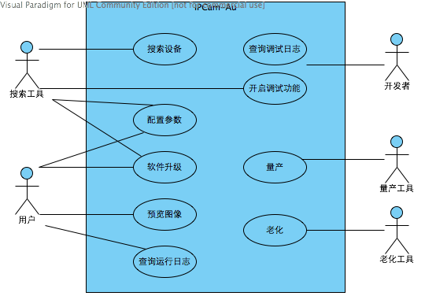

# 修订记录
<table border="1" width="100%">
<tr>
<th bgcolor="#EEEEEE">修订版本</th>
<th width="70%" bgcolor="#EEEEEE">修订摘要</th>
<th bgcolor="#EEEEEE">修订日期</th>
<th bgcolor="#EEEEEE">修订人</th>
</tr>
<tr>
<td align="center">V0.0.9</td>
<td>1. 初稿编写。</td>
<td align="center">2013/12/23</td>
<td align="center">唐成</td>
</tr>
</table>

# 软件需求规格说明书

# 1. 文档概述

---

## 1.1. 目的  

本需求规格说明书对整个基础型网络摄像机的软件规格进行说明，主要包括网络摄像机设备固件以及PC端工具两部分。通过对该系统的规格进行详细的描述，对后续的设计与编码工作提供指导。

## 1.2. 范围

本文档的描述范围包含基础型网络摄像机内部功能和对外接口，以及使用这些接口来实现功能的PC端工具。本文档还会涉及基础型网络摄像机所必须遵循的一些标准。

## 1.3. 定义、首字母缩写词和缩略语

<table border="1" width="100%">
<tr>
<th width="15%" bgcolor="#EEEEEE">缩写</th>
<th width="30%" bgcolor="#EEEEEE">全称</th>
<th bgcolor="#EEEEEE">说明</th>
</tr>

<tr>
<td align="center">IPC</td>
<td align="center">IP Camera</td>
<td>网络摄像机</td>
</tr>

<tr>
<td align="center">PTZ</td>
<td align="center">Pan/Tilt/Zoom</td>
<td>代表云台全方位的移动以及镜头变倍变焦</td>
</tr>

</table>

## 1.4. 参考资料

## 1.5. 概述

* 第2章，将对基础型网络摄像机的整体业务流程进行详细的说明，通过描述完整的业务用例从而得到领域模型和系统用例。  
* 第3章，从系统用例进一步推导出功能需求，包含用例、活动和时序，此为后续设计之基石。  
* 第4章，提出基础型网络摄像机浏览器用户界面的观感要求。  
* 第5章，提出基础型网络摄像机浏览器用户界面的操作要求。  
* 第6章，提出软件的性能要求，从速度、精度、安全性和可靠性几个方面进行约束。  
* 第7章，提出环境要求，对软件运行的软、硬件环境进行约束。  
* 第8章，提出可维护性和可移植性的要求。  
* 第9章，提出政策和法规方面的要求，包括针对社会和政策的因素的规格说明，这些因素会影响产品的可接受性。  
* 第10章，提出法律需求，明确待开发软是否受到某些法律管制，是否需要符合某些标准。  
* 第11章，描述To be defined问题，还未明确但确实会对软件产生影响的问题。
* 第12章，描述成本问题，考虑是否可以购买某些成熟的商业模组，或者使用成熟的开源模组，以及是否存在可被复制的产品。  
* 第13章，描述软件产品是否对已有的环境和系统产生何种影响，考虑软件产品是否会带来新的问题。  
* 第14章，描述需要跟随产品发布的用户文档。  
* 第15章，描述软件产品将来的发展方向和待实现的功能。
* 第16章，支持信息，包含附录、索引等。

# 2. 整体说明

---
IPC最为核心和基础的功能，莫过于将感光元件采集到的光学数字信号经过编码，组帧之后通过IP数字网络传输到监控终端或者存储服务器。在此基础之上，提供其它的一些帮助用户更好更方便使用IPC的辅助功能，例如用户管理、参数配置、固件升级等。

## 2.1. 产品的用户

### 2.1.1. 产品的用户

* IPC操作者

### 2.1.2. 对用户设的优先级

* 关键用户：IPC操作者

## 2.2. 用例模型

### 2.2.1. IPC业务用例

### 2.2.2. IPC业务用例实现

### 2.2.3. IPC概念用例

## 2.3. 假设与依赖关系

*在软件系统的开发过程中，存在许多假设和依赖关系。在本小节中应列举出所有的重要的技术可行性假设、子系统或构件可用性假设，以及一些可行性的假设。*  

# 3. 功能需求

---

*果说第二章节是框架，那么本节就是血肉。在本节中，应该详细列出所有的软件需求，其详细程序应使设计人员能够充分理解并且进行设计的要求，同时也应该给予测试人员足够的信息，以帮助他们来验证系统是否满足了这些需求。整个需求的组织可以采用用例描述进行。*  

## 3.1. 用例描述

*如果你使用用例建模技术，那么你已经通过用例定义了系统的大部分功能性需求和一些非功能性需求。因此，在软件需求规格说明书只需将这些具体的用例描述，整理在一起，全部放在该小节之中。当然也可以将用例描述做为附件，在此列出引用，只是这样做并不利于阅读。建议在组织形式上采用以“软件需求”为线索，在每个需求中填入对应的1个或几个用例描述。*  

# 4. 观感需求

---

*一些与产品的用户界面相关的需求描述。*  

# 5. 易用性需求

---

## 5.1. 易于使用

*描述如何构建符合最终用户期望的产品。*  

## 5.2. 学习的容易程度

*学习使用该产品应该多容易的说明。通常是用学习时间来衡量。*  

# 6. 性能要求

---

## 6.1. 速度需求

*明确完成特定任务需要的时间，这常常指响应时间。*  

## 6.2. 安全性的需求

*对可能造成人身伤害、财产损失和环境破坏所考虑到的风险进行量化描述。*  

### 6.2.1. 该产品是保密的吗？

*关于该被授权使用该产品，以及在什么样的情况下授权等方面的描述。*

### 6.2.2. 文件完整性需求

*关于需要的数据库和其他文件完整性方面的说明。*

### 6.2.3. 审计需求

*关于需要的审计检查方面的说明。*

## 6.3. 精度需求

*对产品产生的结果期望的精度进行量化描述。*

## 6.4. 可靠性和可用性需求

*本节量化产品所需的可靠性。这常常表述为允许的两次失败之间无故障运行时间，或允许的总失败率。*

## 6.5. 容量需求

*本节明确处理的吞吐量和产品存储数据的容量。*

# 7. 环境需求

---

## 7.1. 预期的物理环境

*本节明确产品将操作的物理环境，以及这种环境引起的任何特殊需求。*

## 7.2. 预期的技术环境

*硬件和其它组成新产品操作环境的设备的规范。*

## 7.3. 伙伴应用程序

*对产品必须与之交互的其它应用程序的描述。*

# 8. 可维护性和可移植性需求

---

## 8.1. 维护该产品需要多容易

*对产品作特定修改所需时间的量化描述。*

## 8.2. 是否存在一些特殊情况适用于该产品的维护

*关于预期的产品发布周期和发布将采取的形式的规定。*

## 8.3. 可移植性需求

*对产品必须支持的其他平台或环境的描述。*

# 9. 文件和政策需求

---

*本节包括针对社会和政策的因素的规格说明，这些因素会影响产品的可接受性。如果你开发的产品是针对外国市场的，可能要特别注意这些需求。*  
*问一下是否产品的目标是你所不熟悉的文化环境，是否其它国家的人或其他类型的组织的人会使用该产品。人们是否有与你的文化不同的习惯、节日、迷信、文化上的社会行为规范。*

# 10. 法律需求

---

## 10.1. 该产品是否受到某些法律的管制

*明确该产品的法律需求的描述。*

## 10.2. 是否有一些必须符合的标准

*明确适用的标准和参考的详细标准的描述。*

# 11. Opend问题

---

*对未确定但可能对产品产生重要影响的因素的问题描述。按照需求分析的术语还说，就是TBD（To Be Define）的问题。*

# 12. COTS解决方案

---

## 12.1. 是否有一些制造好的产品可以购买

*应该调查现存产品清单，这些产品可以作为潜在的解决方案。*

## 12.2. 该产品是否可使用制造好的组件

*描述可能用于该产品的候选组件，包括采购的和公司自己的产品。列出来源。*

## 12.3. 是否有一些我们可以复制的东西

*其他相似产品的清单。*

# 13. 新问题

---

## 13.1. 新产品会在当前环境中带来什么问题

*关于新产品将怎样影响当前的实现环境的描述。*

## 13.2. 新的开发是否将影响某些已实施的系统

*关于新产品将怎样与现存系统协同工作的描述。*

## 13.3. 是否我们现有的用户会受到新开发的敌对性影响

*关于现有用户可能产生的敌对性反应的细节。*

## 13.4. 预期的实现环境会存在什么限制新产品的因素

*关于新的自动化技术、新的组织结构方式的任何潜在问题的描述。*

## 13.5. 是否新产品会带来其他问题

*确定我们可能不能处理的情况。*

# 14. 用户文档

---

*用户文档的清单，这些文档将作为产品的一部分交付。*

# 15. 后续版本的需求

---

*一些需要在将来版本实现的需求*

# 16. 支持信息

---

*支持信息用于使软件需求规格说明书更易于使用。它包括：目录、索引、附录等。*

